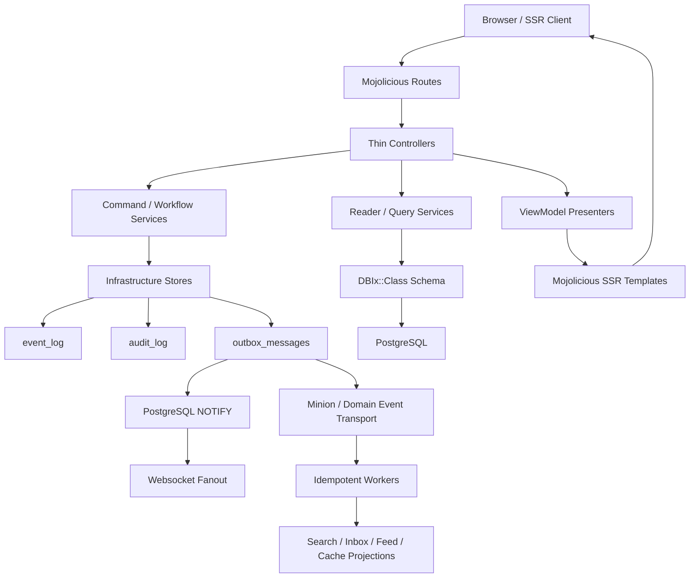

# GPForum Architecture

GPForum is an SSR-first Mojolicious monolith with modular internal boundaries.
The current direction is a layered modular monolith, not a distributed rewrite.

## Architecture Audit

The current repository already has strong boundaries:

- `GPForum.pm` is a small composition root that delegates to bootstrap modules.
- Controllers are HTTP-oriented and increasingly delegate write flows to services.
- DBIx::Class access is outside controllers and enforced by `script/architecture-check`.
- Forum read paths use reader services and presenter view models.
- Event log and outbox tables are real, durable boundaries.
- Minion-facing workers consume outbox domain event payloads.
- SSR templates use shared components, i18n helpers, CSRF fields, and semantic landmarks.

Priority risks found during the audit:

1. `Controller::Forum` remains too large and still owns several response/error helpers.
2. Event, audit, and outbox creation was duplicated in write stores.
3. Raw HTML output existed in templates without a central rendering policy.
4. Browser security headers lived directly in bootstrap, making policy drift harder to test.
5. Theme tokens existed in CSS but lacked a runtime registry and explicit theme contract.
6. The target `Application/Domain/Infrastructure/Web/Security/Theme` structure was not yet represented in code.

## Layer Map

The new structure is introduced incrementally:

- `GPForum::Domain::*`: pure domain contracts, such as event envelopes.
- `GPForum::Application::*`: future command orchestration boundaries.
- `GPForum::Infrastructure::*`: DB/outbox/audit infrastructure coordination.
- `GPForum::Query::*`: future SSR read-model query services.
- `GPForum::Command::*`: CLI commands today; future command handlers should avoid colliding with CLI names.
- `GPForum::Web::*`: SSR rendering policy and web-only presentation rules.
- `GPForum::Jobs::*`: future worker/job payload normalization.
- `GPForum::Security::*`: browser/session/security policies.
- `GPForum::Theme::*`: design token and theme registry.
- `GPForum::I18N::*`: future catalog namespace/extraction discipline.

Existing `Service::*`, `ViewModel::*`, `Worker::*`, and `Bootstrap::*` modules stay in place until there is a low-risk migration path.

## Flow

## Current Decisions

- Durable events use `GPForum::Domain::EventEnvelope`.
- Forum, identity, moderation, privacy, export, attachment, admin role, mention fanout, and rate-limit write paths now use `GPForum::Infrastructure::EventRecorder` for event/outbox/audit coordination.
- Browser headers use `GPForum::Security::BrowserHeaders`.
- Repeated web error hashes use `GPForum::Web::ErrorPayload`.
- Health and realtime transport messages use dedicated `GPForum::Web::*Payload`
  modules so technical JSON contracts stay out of controllers.
- Realtime subscriptions use strict policy-backed authorization and
  PostgreSQL LISTEN/NOTIFY for multi-process enhancement fanout.
- Metrics, robots, sitemap, and Atom feed payload composition also lives in
  dedicated `GPForum::Web::*Payload` modules; service builders still own
  crawler/feed document encoding.
- SSR raw HTML pass-through uses `GPForum::Web::RenderPolicy`.
- Theme metadata and supported token contracts use `GPForum::Theme::Registry`;
  SSR theme selection is validated before it reaches HTML attributes.

## Roadmap

1. Keep new service writes behind `Infrastructure::EventRecorder`; direct `EventLog`, `OutboxMessage`, and `AuditLog` writes should remain confined to infrastructure.
2. Extract common controller response/error/auth helpers into `Web::*`.
3. Introduce explicit query/read-model interfaces for high-traffic SSR pages.
4. Add command handler interfaces around moderation, privacy, attachment, and identity writes.
5. Normalize Minion job payloads through `Jobs::*`.
6. Add i18n namespace validation and catalog extraction reporting.
7. Keep DBIx::Class ResultSet access out of controllers and templates.
