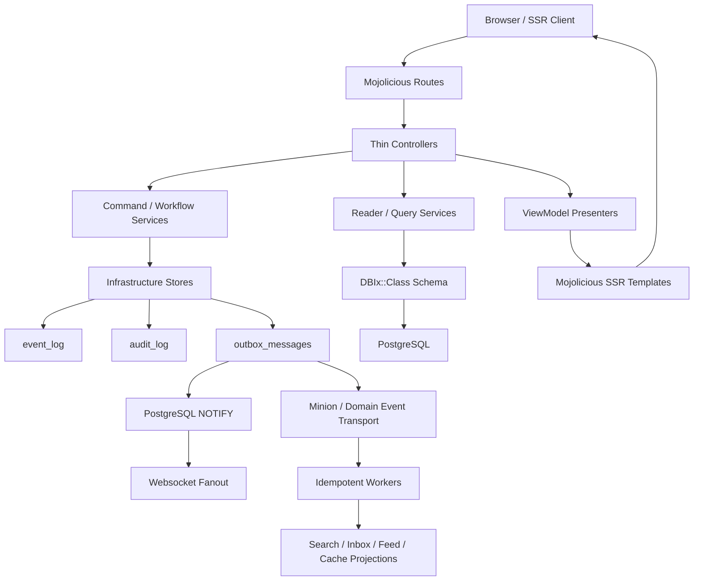

# GPForum Architecture

GPForum is an SSR-first Mojolicious monolith with modular internal boundaries.
The current direction is a layered modular monolith, not a distributed rewrite.

## Architecture Audit

The current repository already has strong boundaries:

- `GPForum.pm` is a small composition root that delegates to bootstrap modules.
- Controllers are HTTP-oriented and increasingly delegate write flows to services.
- DBIx::Class access is outside controllers and enforced by `script/architecture-check`.
- Internal `GPForum::*` module dependency cycles are rejected by
  `script/architecture-check`.
- Forum read paths use reader services and presenter view models.
- Event log and outbox tables are real, durable boundaries.
- Minion-facing workers consume outbox domain event payloads.
- SSR templates use shared components, i18n helpers, CSRF fields, and semantic landmarks.

Priority risks found during the audit:

1. `Controller::Forum` remains too large and still owns several response/error helpers.
   `Controller::Identity`, `Controller::Admin`, and `Controller::Moderation`
   have the same drift risk at smaller scale.
2. Event, audit, and outbox creation was duplicated in write stores.
3. Raw HTML output existed in templates without a central rendering policy.
4. Browser security headers lived directly in bootstrap, making policy drift harder to test.
5. Theme tokens existed in CSS but lacked a runtime registry and explicit theme contract.
6. The target `Application/Domain/Infrastructure/Web/Security/Theme` structure was not yet represented in code. ADR 0107 replaced it with the layers the code has, and a check.

## Layer Map

Five layers, listed from the top. A module may depend on its own layer and the
layers below it, never on one above ([ADR 0107](docs/adr/0107-layers-are-the-namespaces-that-exist.md)).
`GPForum::Application::LayerMap` declares them and `t/192-layering.t` checks
every module in `lib/` against the declaration; `script/architecture-check`
runs the same test.

| Layer | Namespaces | Holds |
| --- | --- | --- |
| composition | the `GPForum` class, `Bootstrap`, `CLI`, `Application` | wiring the others together |
| adapter | `Controller`, `Command`, `Worker`, `Benchmark` | the ways in: HTTP, the command line, jobs |
| presentation | `Web`, `ViewModel`, `View`, `Theme`, `Security`, `I18N` | turning service results into pages and headers |
| service | `Service` | the application: rules, workflows, readers, stores |
| foundation | `Config`, `Log`, `Runtime`, `OS`, `Domain`, `Jobs`, `Schema`, `Migration`, `Infrastructure` | configuration, persistence, cross-cutting contracts |

A new top-level namespace fails the check until it is placed in a layer. This
is a layered architecture, not a hexagonal one: services read and write through
DBIx::Class directly, and ADR 0107 says so.

## Flow

## Current Decisions

- Durable events use `GPForum::Domain::EventEnvelope`.
- Forum, identity, moderation, privacy, export, attachment, admin role, mention fanout, and rate-limit write paths now use `GPForum::Infrastructure::EventRecorder` for event/outbox/audit coordination. Canonical audit hashing lives in `GPForum::Infrastructure::AuditRecord`.
- Browser headers use `GPForum::Security::BrowserHeaders`.
- Repeated web error hashes use `GPForum::Web::ErrorPayload`.
- Health and realtime transport messages use dedicated `GPForum::Web::*Payload`
  modules so technical JSON contracts stay out of controllers.
- Realtime subscriptions use strict policy-backed authorization and
  PostgreSQL LISTEN/NOTIFY for multi-process enhancement fanout.
- Metrics, robots, sitemap, and Atom feed payload composition also lives in
  dedicated `GPForum::Web::*Payload` modules; service builders still own
  crawler/feed document encoding.
- SSR raw HTML pass-through uses `GPForum::Web::RenderPolicy`.
- Theme metadata and supported token contracts use `GPForum::Theme::Registry`;
  SSR theme selection is validated before it reaches HTML attributes.

## Roadmap

1. Keep new service writes behind `Infrastructure::EventRecorder`; direct `EventLog`, `OutboxMessage`, and `AuditLog` writes should remain confined to infrastructure.
2. Extract common controller response/error/auth helpers into `Web::*`.
3. Readers expose the resultsets they execute (`*_resultset`), which the query-plan gate EXPLAINs; keep new high-traffic readers to that shape.
4. Add command handler interfaces around moderation, privacy, attachment, and identity writes.
5. Normalize Minion job payloads through `Jobs::*`.
6. Add i18n namespace validation and catalog extraction reporting.
7. Keep DBIx::Class ResultSet access out of controllers and templates.
