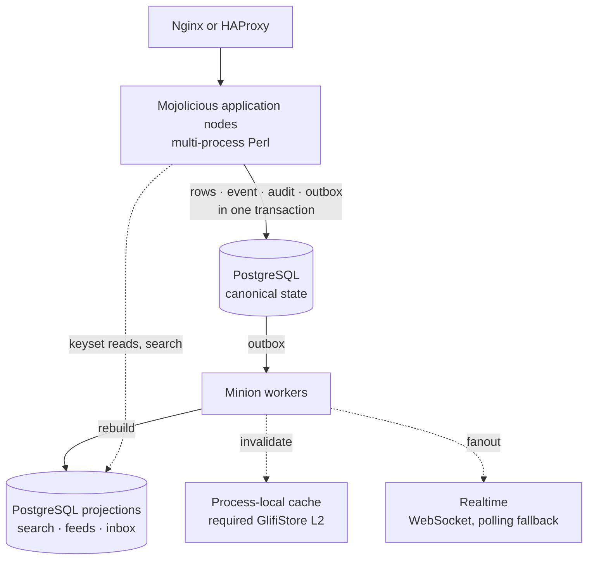

<p align="center">
  
</p>

<p align="center">
  <picture>
    <source media="(prefers-color-scheme: dark)" srcset="assets/img/gpforum-logo-dark.svg">
    
  </picture>
</p>

<p align="center">
  <strong>Durable forums, explicit governance, serious moderation.</strong><br>
  A Perl-native community platform on PostgreSQL, built to be operated for years.
</p>

<p align="center">
  <a href="https://github.com/gpicchiarelli/GPForum/actions/workflows/ci.yml"></a>
  <a href="https://github.com/gpicchiarelli/GPForum/actions/workflows/project-hygiene.yml"></a>
  <a href="LICENSE"></a>
  <a href="cpanfile"></a>
  <a href="prompt/42.txt"></a>
</p>

<p align="center">
  <a href="#why-gpforum">Why</a> ·
  <a href="#what-works-today">Features</a> ·
  <a href="#architecture">Architecture</a> ·
  <a href="#quick-start">Quick start</a> ·
  <a href="#status">Status</a> ·
  <a href="docs/README.md">Documentation</a>
</p>

<br>

## Why GPForum

Most forum software is built for launch day. GPForum is built for year ten:
discussions that stay findable, moderation that can be explained and reversed,
and a stack a small team can still run long after the hype has moved on.

It is not a clone of legacy forum software. The project starts from an
architectural constitution — the 53 architectural prompt constitutions in [prompt](prompt) —
that defines how the platform behaves, scales, is tested, profiled, governed,
and evolved. Code follows the contract, and tests keep both honest.

<table>
  <tr>
    <td width="33%" valign="top">
      <strong>PostgreSQL is the truth</strong><br>
      Canonical tables are authoritative. Search, feeds, counters, and caches are derived and rebuildable.
    </td>
    <td width="33%" valign="top">
      <strong>Server-rendered first</strong><br>
      Semantic, accessible HTML targeting WCAG 2.2 AA, with JSON on request. No SPA required.
    </td>
    <td width="33%" valign="top">
      <strong>Every change leaves a trace</strong><br>
      Domain events, audit records, and a transactional outbox, committed together.
    </td>
  </tr>
  <tr>
    <td valign="top">
      <strong>Moderation you can explain</strong><br>
      Scoped roles, reversible actions, suspensions, and a staff history that holds up to scrutiny.
    </td>
    <td valign="top">
      <strong>Measured, not guessed</strong><br>
      Coverage, profiling, and per-route query budgets are release gates, not afterthoughts.
    </td>
    <td valign="top">
      <strong>Boring to operate</strong><br>
      Multi-process Perl, locked dependencies, Debian or FreeBSD behind a reverse proxy.
    </td>
  </tr>
</table>

## What works today

| Area | Capabilities |
| --- | --- |
| **Forum** | Categories, threads, replies, canonical slugs, per-user read progress. Read paths use keyset pagination — never `OFFSET`. |
| **Identity** | Registration, login, logout, public profiles. Argon2id hashing, server-side sessions, UUIDv7 identifiers, CSRF on state-changing requests. |
| **Community** | Bookmarks, thread follow and mute, `@username` mentions, reputation and trust snapshots, a derived personal feed. |
| **Moderation** | Thread and post reports, staff queue, reversible hide/restore and lock/unlock, suspensions, action history. |
| **Administration** | Role and permission catalogs, scoped role bindings, audit review, idempotent owner bootstrap. |
| **Search and discovery** | PostgreSQL FTS and `pg_trgm`, permission-aware queries, autocomplete, `robots.txt`, sitemap, Atom feed. |
| **Notifications and realtime** | Subscriptions, preferences, inbox with read state; process-local WebSocket fanout with a polling fallback. |
| **Attachments** | Upload intent, validation, lifecycle, variants, scanning hook, media processing worker. |
| **Privacy** | Account deletion requests, erasure jobs, retention legal holds, staff data-rights review. |
| **Portability and plugins** | Import/export manifests, dry-run imports, legacy id mapping; plugin registry, named hooks, observable failures. |
| **Platform** | Event and audit logs, transactional outbox with retries and dead letters, projection offsets and blue/green rebuilds, Minion workers, readiness checks, rate limiting, metrics. |

Thread, reply, report, moderation, and suspension writes go through store
boundaries that commit canonical rows, the domain event, the audit record, and
the outbox handoff in a single PostgreSQL transaction. Derived state — feeds,
mentions, search documents, caches — is rebuildable and never authoritative.

<details>
<summary><strong>HTTP routes</strong></summary>

<br>

Read routes render semantic, accessible SSR by default and return JSON with
`Accept: application/json` or `?format=json`. State-changing routes require an
authenticated session and a CSRF token; SSR forms redirect back into the
discussion, while JSON clients receive `201 Created`. Full behaviour is
described in [docs/MVP.md](docs/MVP.md).

| Area | Routes |
| --- | --- |
| Forum | `GET /` · `GET /categories` · `GET /c/:category_id` · `GET /t/:thread_id` · `GET /t/:thread_id/:slug` · `GET /new-thread` · `POST /threads` · `POST /t/:thread_id/replies` · `POST /t/:thread_id/read` |
| Community | `GET /feed` · `GET /bookmarks` · `POST /t/:thread_id/bookmark` · `POST /t/:thread_id/bookmark/remove` · `POST /t/:thread_id/subscribe` · `POST /t/:thread_id/subscribe/mute` · `POST /t/:thread_id/subscribe/remove` · `GET /u/:username` |
| Notifications | `GET /notifications` · `POST /notifications/:notification_id/read` · `GET /mentions` |
| Reports | `POST /t/:thread_id/report` · `POST /p/:post_id/report` |
| Moderation | `GET /moderation/reports` · `GET /moderation/actions` · `GET /moderation/suspensions` · `POST /moderation/reports/:report_id/assign` · `POST /moderation/reports/:report_id/resolve` · `POST /moderation/posts/:post_id/hide` · `POST /moderation/posts/:post_id/restore` · `POST /moderation/threads/:thread_id/lock` · `POST /moderation/threads/:thread_id/unlock` · `POST /moderation/actions/:action_id/reverse` · `POST /moderation/users/:user_id/suspend` · `POST /moderation/suspensions/:suspension_id/revoke` |
| Administration | `GET /admin` · `GET /admin/roles` · `POST /admin/roles` · `POST /admin/permissions` · `POST /admin/roles/:role_id/permissions` · `GET /admin/users/:user_id/roles` · `POST /admin/users/:user_id/roles` · `POST /admin/role-bindings/:binding_id/revoke` · `GET /admin/audit` |
| Search and discovery | `GET /search?q=...` · `GET /search/autocomplete?q=...` · `GET /robots.txt` · `GET /sitemap.xml` · `GET /feed.atom` |

The admin console is available to operators holding `admin_console.view` or
`admin_console.manage`. Grant initial access outside HTTP with
`bin/gpforum-admin-bootstrap --user-id USER_ID`, which is idempotent and writes
through the same role catalog and binding boundaries.

</details>

## Architecture



The runtime is Perl-first and process-first; threads are reserved for bounded,
reviewed workloads. Search is PostgreSQL-native by default, and any external
engine requires an ADR and stays an optional, derived accelerator.

| Concern | Decision |
| --- | --- |
| Language | Modern Perl 5.38+ |
| Web | Mojolicious, server-rendered first |
| Persistence | PostgreSQL as the authoritative system of record |
| Schema | Canonical tables separated from rebuildable projections |
| Search | PostgreSQL FTS, `tsvector`, GIN, `pg_trgm`, Perl orchestration |
| Events | Partition-aware event and audit logs, transactional outbox |
| Async | Minion workers |
| Caching | Process-local L1 plus required disposable GlifiStore shared L2 |
| Dependencies | Carton with a locked `cpanfile.snapshot` |
| Quality | Perl::Critic, perltidy, Devel::Cover, Devel::NYTProf |
| Platforms | Debian and FreeBSD behind Nginx or HAProxy |

## Quick start

GPForum runs on the **OS system Perl** only (`/usr/bin/perl` on
Debian/Ubuntu, distro `perl5` on FreeBSD). Version managers and custom
PREFIX builds are unsupported. You need Perl 5.38+ (Ubuntu 24.04 ships
5.38.x), Carton for that interpreter, and PostgreSQL client development files.

```sh
# Debian/Ubuntu
sudo apt install perl build-essential cpanminus libpq-dev postgresql-client
sudo cpanm -M https://cpan.metacpan.org/ Carton

# FreeBSD
# sudo pkg install perl5 p5-App-cpanminus postgresql16-client
# sudo cpanm -M https://cpan.metacpan.org/ Carton

which perl; perl -v                 # expect /usr/bin/perl (or FreeBSD pkg perl)
make system-perl                    # script/gpforum-system-perl --preflight
make install-deps-postgres          # carton install --deployment from the lock
# or: script/bootstrap-deps --postgres
script/system-preflight             # check the host
script/gpforum-carton exec perl -Ilib bin/gpforum-migrate --plan
script/gpforum-carton exec perl -Ilib bin/gpforum-migrate --apply
```

Carton is a host tool for system Perl; `script/gpforum-carton` locates it next
to that interpreter (or via `GPFORUM_CARTON`). CPAN app deps still live under
`local/` via Carton.

Production and CI install only the pinned `cpanfile.snapshot` tree over the
official MetaCPAN HTTPS mirror (`PERL_CARTON_MIRROR=https://cpan.metacpan.org/`).
To refresh the lock after a `cpanfile` change, run
`script/bootstrap-deps --update --postgres` on a development host and commit
the new snapshot. Do not point Carton at unofficial or `http://` mirrors.

Run the full quality gate — syntax, tests, Perl::Critic, perltidy, and the
architecture contract:

```sh
make check
```

Coverage, benchmarks, and profiling:

```sh
script/coverage
script/bench-http --iterations 5 --warmup 1 --route /health/live --route /t/thread-1
script/profile-route /categories
```

Preview the static project page with `python3 -m http.server 8000`, then open
`http://127.0.0.1:8000/index.html`.

## Operations

- **Runtime defaults** follow a small-production profile: loopback listener
  behind a reverse proxy, backlog `256`, Hypnotoad clients `250`, request
  recycle `1000`, keep-alive `5s`, realtime listener on, local cache `2048`
  entries, category cache TTL `60s`, open-file-descriptor floor `65536`. They
  are defaults, not benchmark evidence — prove them in staging.
- **Caching** is a pure-Perl, process-local, disposable cache with namespaces,
  TTL, size limits, key and tag invalidation, and metrics. It covers read-mostly
  category lists (`GPFORUM_LOCAL_CACHE_MAX_ENTRIES`,
  `GPFORUM_CATEGORY_CACHE_TTL_SECONDS`) and is invalidated by workers consuming
  domain events. Shared L2 is GlifiStore via `GPFORUM_GLIFISTORE_URL`
  (`tcp://host:port` or `unix://path`), default `tcp://127.0.0.1:7379`.
  Staging and production fail closed if the URL is missing. When GlifiStore
  is unreachable, GPForum keeps serving from process-local L1 and PostgreSQL.
- **Host posture** is validated at config load through `GPFORUM_OS_REUSEPORT`,
  `GPFORUM_OS_SENDFILE`, `GPFORUM_OS_AFFINITY`,
  `GPFORUM_OS_MIN_RECOMMENDED_WORKERS`, and
  `GPFORUM_OS_MAX_OPEN_FILE_DESCRIPTORS`, and reported by `/health/ready`,
  `/metrics`, and `script/system-preflight`.
- **Query budgets** for hot paths are exposed in metrics and managed with
  `carton exec bin/gpforum-query-budget --print|--sync|--check`.
- **Deploy gate:** `carton exec bin/gpforum-platform-check --local|--strict-local|--with-db|--strict-with-db`
  checks OS preflight and, when database-backed, query budget drift.

Deployment units for systemd, FreeBSD rc, Nginx, Caddy, and launchd live in
[deploy](deploy); the step-by-step guide is
[docs/DEPLOYMENT.md](docs/DEPLOYMENT.md).

## Status

GPForum has completed **Milestones 0–10** under
[ADR 0068](docs/adr/0068-mvp-roadmap-sequencing.md) (Forum HTTP MVP through
advanced community features). Architecture and catalog discipline follow
[ADR 0091](docs/adr/0091-executable-architecture-contract.md). Everything
under [What works today](#what-works-today) is implemented and tested;
residual work is evidence and ops, not missing MVP code.

| Target | Status | What stands in the way |
| --- | --- | --- |
| Local, personal use | Ready | — |
| Private beta | Not yet | Live staging evidence for attachment restore + nginx/systemd deploy, SMTP, operator runbooks — PG evidence, DB/attachment drills, and stress-load harness are shipped |
| Public production | Not yet | Record staging stress 100/500/1000 via `script/stress-load`; live attachment restore + deploy evidence via staging drills (harnesses shipped) |

**Known MVP limits.** Domain realtime fanout uses PostgreSQL `LISTEN`/`NOTIFY`
across processes; the websocket registry remains process-local by design.
Rate limiting is PostgreSQL-backed with a local degraded fallback. Search
depends on PostgreSQL projection rows. Reply positions are allocated under a
thread-row `FOR UPDATE` lock plus the uniqueness constraint on
`(thread_id, position)`.

[docs/PRODUCTION_READINESS.md](docs/PRODUCTION_READINESS.md) is the release
contract, [ROADMAP.md](ROADMAP.md) tracks what comes next, and the latest
go / no-go assessment is in
[docs/release/readiness-review.md](docs/release/readiness-review.md).

## Repository layout

| Path | Contents |
| --- | --- |
| [`lib/GPForum`](lib/GPForum) | Mojolicious application, services, view models, DBIx::Class schema |
| [`templates`](templates) · [`themes`](themes) · [`assets`](assets) | SSR templates, design tokens, visual identity |
| [`migrations`](migrations) | PostgreSQL schema: identity, events and audit, forum hot paths, governance |
| [`bin`](bin) · [`script`](script) | Operational commands and quality, benchmark, profiling automation |
| [`deploy`](deploy) · [`etc`](etc) | Service units, reverse-proxy configuration, runtime profiles |
| [`t`](t) | Test suite |
| [`docs`](docs) | Architecture, operations, performance, security, and ADRs |
| [`prompt`](prompt) | Architectural prompt constitutions |

## Documentation

Start from the [documentation index](docs/README.md). The most useful entry
points are [ARCHITECTURE.md](ARCHITECTURE.md), [docs/MVP.md](docs/MVP.md),
[EVENTS.md](EVENTS.md), [docs/PRODUCTION_READINESS.md](docs/PRODUCTION_READINESS.md),
and the [architecture decision records](docs/adr).

The GitHub project success surface — [CONTRIBUTING.md](CONTRIBUTING.md),
[SECURITY.md](SECURITY.md), [GOVERNANCE.md](GOVERNANCE.md),
[SUPPORT.md](SUPPORT.md), [ROADMAP.md](ROADMAP.md),
[CHANGELOG.md](CHANGELOG.md), [docs/adr](docs/adr), and the templates in
[.github](.github) — is part of the release contract, not decoration.

## Governance

When documents conflict:

1. Security and privacy constraints win.
2. Final-decision prompts win over exploration memos.
3. More specific domain prompts win over broad philosophy.
4. Intentional architecture changes require ADRs.

<details>
<summary><strong>Final architectural decisions</strong></summary>

<br>

- Redis/KeyDB is optional acceleration, not correctness infrastructure.
- OpenSearch is no longer default; PostgreSQL-native search is authoritative.
- Perl application runtime is multi-process and process-first.
- Carton, coverage, profiling, and Perl::Critic are mandatory automation surfaces.
- Prompt alignment is mandatory for every architecture-changing implementation.
- GitHub project success surface is mandatory for reviewability, security, contribution, and release discipline.
- Architecture-by-verifiable-invariants is mandatory for long-term correctness, release discipline, and maintainability.
- Accessibility engineering is mandatory for participation equality, WCAG enforcement, semantic rendering, and release correctness.
- Human-centered community lifecycle design is mandatory for durable participation without dark patterns.
- Core boundary discipline is mandatory: small stable core, capability-scoped plugins, no controller business logic, and no cache/projection authority.
- OS-level performance discipline is mandatory: persistent Perl processes, centralized OS abstraction, bounded hot paths, reverse-proxy file delivery, PostgreSQL coordination, and profiling before invasive optimization.
- Execution constitution is mandatory: every workflow change must identify canonical state, event emission, projection impact, audit record, indexes, permissions, failure mode, rebuildability, replayability, and operational scaling.
- Operational scalability and projection stability are mandatory: hot paths must be bounded, projections idempotent and rebuildable, query topology explainable, outbox delivery observable, and optional derived systems gracefully degradable.
- Domain integrity, authorization correctness, and moderation safety are mandatory: workflows must preserve canonical truth, explicit permissions, visibility/moderation state, event/audit traceability, anti-leak guarantees, cache invalidation, and replay-safe projections.
- Search, feed, syndication, and retrieval safety are mandatory: PostgreSQL-native discovery surfaces must remain derived, rebuildable, permission-aware, moderation-aware, bounded, observable, cache-safe, and anti-leak.

</details>

<details>
<summary><strong>Prompt constitutions</strong></summary>

<br>

**Foundations**

| # | Constitution | # | Constitution |
| --- | --- | --- | --- |
| [1](prompt/1.txt) | Foundation | [9](prompt/9.txt) | Authorization and governance |
| [2](prompt/2.txt) | Infrastructure | [10](prompt/10.txt) | Observability |
| [3](prompt/3.txt) | Database | [11](prompt/11.txt) | CI/CD |
| [4](prompt/4.txt) | Perl engineering | [12](prompt/12.txt) | APIs |
| [5](prompt/5.txt) | Security | [13](prompt/13.txt) | Domain model |
| [6](prompt/6.txt) | Frontend | [14](prompt/14.txt) | Search |
| [7](prompt/7.txt) | Realtime | [15](prompt/15.txt) | Performance |
| [8](prompt/8.txt) | Workers | [16](prompt/16.txt) | Software engineering |

**Implementation and operations**

| # | Constitution | # | Constitution |
| --- | --- | --- | --- |
| [17](prompt/17.txt) | Community operations | [36](prompt/36.txt) | Test strategy |
| [19](prompt/19.txt) | Cache and Redis decision | [37](prompt/37.txt) | API contracts |
| [20](prompt/20.txt) | MVP roadmap (historical; binding: [ADR 0068](docs/adr/0068-mvp-roadmap-sequencing.md)) | [38](prompt/38.txt) | Packaging and deployment |
| [21](prompt/21.txt) | Initial schema | [39](prompt/39.txt) | Prompt governance |
| [22](prompt/22.txt) | Permission matrix | [40](prompt/40.txt) | Perl multi-process scaling |
| [23](prompt/23.txt) | Event catalog | [41](prompt/41.txt) | Profiling and coverage automation |
| [24](prompt/24.txt) | HTTP workflows | [42](prompt/42.txt) | PostgreSQL-native search |
| [25](prompt/25.txt) | UX | [43](prompt/43.txt) | Executable architecture contract (historical; binding: [ADR 0091](docs/adr/0091-executable-architecture-contract.md)) |
| [26](prompt/26.txt) | Privacy | [44](prompt/44.txt) | GitHub project success contract |
| [27](prompt/27.txt) | Runbooks | [45](prompt/45.txt) | Verifiable engineering invariants |
| [28](prompt/28.txt) | Bootstrap implementation | [46](prompt/46.txt) | Accessibility engineering |
| [29](prompt/29.txt) | Configuration | [47](prompt/47.txt) | Human-centered community lifecycle |
| [30](prompt/30.txt) | Email | [48](prompt/48.txt) | Core boundary and architectural discipline |
| [31](prompt/31.txt) | Admin console | [49](prompt/49.txt) | OS-level performance |
| [32](prompt/32.txt) | Content policy | [50](prompt/50.txt) | Execution constitution for operational integrity |
| [33](prompt/33.txt) | Import/export | [51](prompt/51.txt) | Operational scalability and projection stability |
| [34](prompt/34.txt) | SEO and syndication | [52](prompt/52.txt) | Domain integrity, authorization, and moderation |
| [35](prompt/35.txt) | Plugins | [53](prompt/53.txt) | Search, feed, syndication, and retrieval |

[prompt/18.txt](prompt/18.txt) is an exploration memo;
[prompt/19.txt](prompt/19.txt) and [prompt/42.txt](prompt/42.txt) are
authoritative final decisions.

</details>

## Contributing

Contributions are welcome when they keep the project independent, Perl-first,
PostgreSQL-authoritative, and explicit. Read [CONTRIBUTING.md](CONTRIBUTING.md),
run `make check` before opening a pull request, and pair architecture changes
with an ADR. Report vulnerabilities privately as described in
[SECURITY.md](SECURITY.md).

## License

GPForum is released under the [BSD-3-Clause license](LICENSE) and is
compatible with commercial use.
